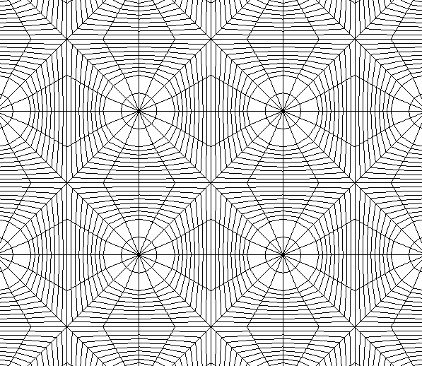

### macro_alone

Example of a boundary condition problem using the macro code. 

Dimension: 2

Geometry : Square, we can use triangles or quads.

Needs : `PETSC`, `SLEPC`, `ParMETIS`, `MPI`, `Gmsh`

In this problem we are going to test two executions modes available in *macro*:
   * The *normal* execution mode (`-normal`) : it is a quasi-static simulation that depends on time dependent boundary
     conditions.
   * The *eigen-system* execution mode (`-eigen`) : is the calculation of the eigen-modes of the problem.

```bash
cd macro_alone
```

On the execution file `run.sh` you can see a line:

```bash
    -dim 2            \
    -mesh_gmsh        \
    -mesh cube_2d.msh \
```

These are arguments to the program and indicate that the mesh file has `gmsh` format and 
that the path to the file is `cube_2d.msh`.


## Eigensystem

Lets solve the eigen-system associated with this problem. First we run `gmsh` and
generate `cube_2d.msh`. You can change the mesh parameters, for example, the number 
of elements in *x* and *y* directions ( `vim cube_2d.geo`):

```bash
N = 30;
```

If you want triangles on your mesh comment the line

```bash
//Recombine Surface {6};
```

then:

```bash
gmsh -2 cube_2d.geo
```

will generate `cube_2d.msh`.

The line in `run.sh`:

```bash
    -boundary "X0 11 0 0","X1 11 1 0" \
```
indicates that on all nodes of `X0` and `X1` we are going to put Dirichlet boundary conditions and this is 
important in this problem. In fact at least we need *one* Dirichlet degree of freedom for 
this problem to have a unique solution.

time to run the eigensystem ! Only configure in `run.sh` the option `-eigen` to appear
as an argument, `-normal` should *not* appear for this case. You can select the number 
of eigenvalues to compute with the option `-eps_nev 2`. Remember to comfigure in `run.sh` your `mpiexec` 
path correctly in the line `MPIEXEC="/home/guido/libs/openmpi-install/bin/mpiexec"`. Finally
do:

```bash
./run.sh
```
The results are stored in files `macro_eigen_*.pvtu` and you can see the solution in `paraview`


## Normal execution

In this problem we impose time dependent boundary conditions and we solve the quasi-static elasticity equation without
inertial forces. The most important lines here are:

```bash
    -boundary "X0 11 0 0","X1 11 1 0" \
```

this is boundary conditions that indicate the physical entity `X0` first follow by a code `11` that means that we
are going to impose Dirichlet on `y` and `x` directions on every node of `X0` ( 0 for Neumann ) and then a function
number ` 1 0` that means to put function 1 on `x` and function 0 on `y` ( these numbers are not taken into account in
`-eigen` mode ). All the boundaries should have a function associated even if they are null for all time, we should
define the 0 function as we show below.

```bash
    -function "0 2 0.0 0.0 1.0 0.0","1 2 0.0 0.0 1.0 0.001" \
```
The functions used. The first number is the function number (`0`) the second is the number of points that define it
(`2`) and the others are the two points defined in the format `x0 y0 x1 y1`. Notice that function `0`  is  0 for all
time between (0,1) sec. 

```bash
    -material "MATRIX TYPE_0 1.0e7 1.0e6 0.3" \
```

This is the material definition. The first argument is the material name (`MATRIX`) then the material type `TYPE_0` this
is a linear elastic material and `1.0e7 1.0e6 0.3` are the density, *Young* modulus and *poisson* modulus respectively.


Execute in parallel with :

```bash
./run.sh
./run.sh 2
...
```


### micro_alone


Example of a simple homogenization that can be perform using :

  *  uniform strains 
  *  parallel mixture theory 
  *  serial mixture theory 

Needs : `PETSC`, `MPI`, `Gmsh`

Dimension: 2

Geometry : the microstructure is a simple circular fiber.

```bash
cd micro_alone
./run.sh 4
```

```bash
Constitutive Average Tensor
2.050980e+06 7.787895e+05 0.000000e+00
7.786073e+05 2.050987e+06 0.000000e+00
0.000000e+00 0.000000e+00 6.080510e+05
```


### fron_fib

Example where the heterogeneities are solved by the direct method :


[//]: # (add this to control image size width="400" height="400")

Using a mesh like:


If we made a zoom:



Then the solution can be obtain by doing:

```bash
./direct
```
if you check inside you can notice you can vary the material properties:

```bash
-material "MATRIX TYPE_0 1.0e7 1.0e6 0.3","FIBER TYPE_0 1.0e7 1.0e6 0.3","MICRO TYPE_1" \
```
and the boundary conditions:

```bash
-boundary "X0 11 0 0","X1 11 1 0" \
```
These are two different boundaries that are present in the domain.
In the first one the first string `X0` is the name of the physical entity specified equally
in the gmsh file the second number `11` means that you will impose Dirichlet on `y` and `x` 
direction respectivelly and `0 0` means to that those boundary condition follows the function of time 
number `0` for `x` and `0` for `y`.

These functions are defined in the next line
```bash
-function "0 2 0.0 0.0 1.0 0.0","1 2 0.0 0.0 1.0 0.01" \
```
Here we have two functions `0` and `1` (are the first number that appear on each one).
Each function has `2` values and we give them as `x0 y0 x1 y1` then the interpolation is linear in time.

Then the solution is given in plot in `macro_t_1.pvtu`

The stress distribution is


and by the homogenization using:

  *  uniform strains 
  *  parallel mixture theory 
  *  serial mixture theory 

Dimension: 2

Geometry : A square piece of composite with fiber perpendicular to the plane


### tran_fib

Example where the heterogeneities are solved by the direct method and by the homogenization using:

  *  uniform strains 
  *  parallel mixture theory 
  *  serial mixture theory 

Dimension: 2

Geometry : A square piece of composite with fiber transversal to the plane
