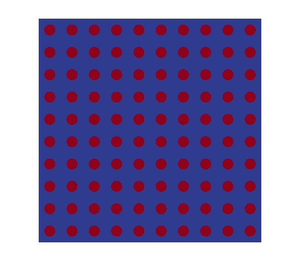

### macro_alone

Example of a boundary condition problem. 
The "-eigensys" or a "-normal" execution can be selected.

Dimension: 2

Geometry : Square, we can use triangles or quads.

### micro_hom

Example of a simple homogenization that can be perform using :

  *  uniform strains 
  *  parallel mixture theory 
  *  serial mixture theory 

Dimension: 2

Geometry : the microstructure is a simple circular fiber.

### fron_fib

Example where the heterogeneities are solved by the direct method :



Using a mesh like:


If we made a zoom:


Then the solution can be obtain by doing:

```bash
./direct
```
if you check inside you can notice you can vary the material properties:

```bash
-material "MATRIX TYPE_0 1.0e7 1.0e6 0.3","FIBER TYPE_0 1.0e7 1.0e6 0.3","MICRO TYPE_1" \
```
and the boundary conditions:

```bash
-boundary "X0 11 0 0","X1 11 1 0" \
```
These are two different boundaries that are present in the domain.
In the first one the first string `X0` is the name of the physical entity specified equally
in the gmsh file the second number `11` means that you will impose Dirichlet on `y` and `x` 
direction respectivelly and `0 0` means to that those boundary condition follows the function of time 
number `0` for `x` and `0` for `y`.

These functions are defined in the next line
```bash
-function "0 2 0.0 0.0 1.0 0.0","1 2 0.0 0.0 1.0 0.01" \
```
Here we have two functions `0` and `1` (are the first number that appear on each one).
Each function has `2` values and we give them as `x0 y0 x1 y1` then the interpolation is linear in time.

Then the solution is given in plot in `macro_t_1.pvtu`

The stress distribution is


and by the homogenization using:

  *  uniform strains 
  *  parallel mixture theory 
  *  serial mixture theory 

Dimension: 2

Geometry : A square piece of composite with fiber perpendicular to the plane


### tran_fib

Example where the heterogeneities are solved by the direct method and by the homogenization using:

  *  uniform strains 
  *  parallel mixture theory 
  *  serial mixture theory 

Dimension: 2

Geometry : A square piece of composite with fiber transversal to the plane
